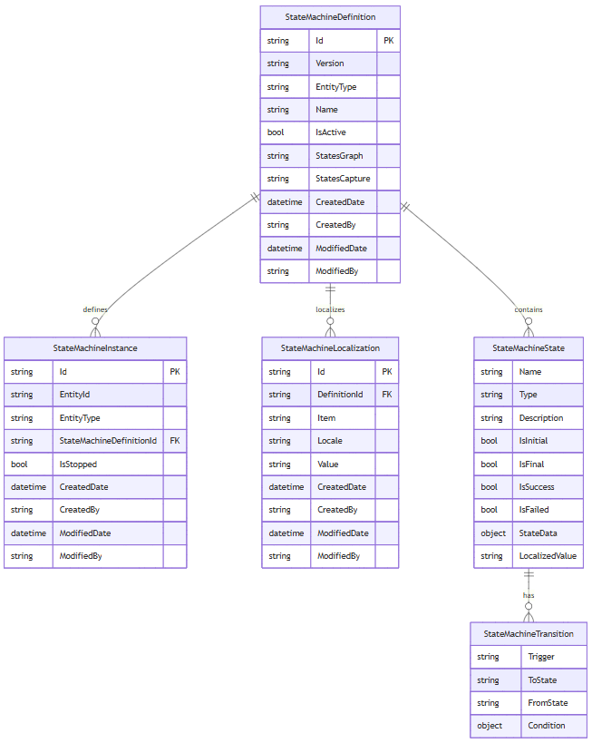

# Virto Commerce State Machine Module

[](https://github.com/VirtoCommerce/vc-module-state-machine/actions/workflows/module-ci.yml)

The Virto Commerce State Machine module provides a powerful framework for managing complex business processes through configurable state machines. This module enables you to model and control entity lifecycles with states, transitions, conditions, and custom actions.

## Key Features

- **Configurable State Machines**: Define custom workflows for any entity type in your system
- **Visual State Machine Editor**: Intuitive drag-and-drop interface for creating and editing state machines
- **Conditional Transitions**: Set up complex business rules with transition conditions
- **Custom Actions**: Implement custom logic for state transitions and entity operations
- **Multi-language Support**: Localize state and transition names for global applications
- **Entity Type Registration**: Easily bind state machines to any business entity
- **Extensible Architecture**: Register custom conditions and actions through the modular framework
- **Operator & Vendor Portal Integration**: Seamless integration with both admin and customer portals

## Documentation

1. [Main Concept](docs/01-main-concept.md) - Understanding state machine fundamentals and module overview
2. [Data Structure](docs/02-data-structure.md) - Data classes, relationships, and entity schema
3. [Entity Types in State Machines](docs/03-entity-types.md) - Entity registration and management
4. [State Machine Visual Editor](docs/04-visual-editor.md) - Creating and editing state machines through the UI
5. [Transition Conditions](docs/05-transition-conditions.md) - Working with conditions and custom logic
6. [Operator Portal Actions](docs/06-operator-portal-actions.md) - State machine operations in the admin interface
7. [Vendor Portal Actions](docs/07-vendor-portal-actions.md) - State machine integration in customer portals

## Getting Started

### Prerequisites

- Virto Commerce Platform 3.883.0 or higher
- VirtoCommerce.Core module 3.802.0 or higher

### Installation

The State Machine module can be installed through the Virto Commerce Admin Portal:

1. Navigate to **Configuration → Modules**
2. Search for "State Machine"
3. Click **Install** and restart the platform

Alternatively, install via Package Manager Console:

```
Install-Module VirtoCommerce.StateMachine
```

### Basic Usage

1. **Register Entity Type**: Register your business entities with the state machine system
2. **Create State Machine**: Use the visual editor to design your workflow
3. **Configure Transitions**: Set up conditions and actions for state changes
4. **Integrate with Frontend**: Implement state machine actions in your portals

## Web API

Web API documentation is automatically generated and can be accessed at:
- **Swagger UI**: `https://your-domain/docs/VirtoCommerce.StateMachine`
- **OpenAPI Spec**: `https://your-domain/docs/VirtoCommerce.StateMachine/swagger.json`

## Database Model

The module uses the following core entities:



- **StateMachineDefinition**: Main configuration entity
- **StateMachineInstance**: Runtime instances tied to business entities
- **StateMachineLocalization**: Multi-language support for states and transitions

## Examples

### E-commerce Order Processing
```json
{
  "name": "Order Processing",
  "entityType": "Order",
  "states": [
    { "name": "New", "isInitial": true },
    { "name": "Paid", "transitions": [{"trigger": "Ship", "toState": "Shipped"}] },
    { "name": "Shipped", "transitions": [{"trigger": "Deliver", "toState": "Delivered"}] },
    { "name": "Delivered", "isFinal": true, "isSuccess": true }
  ]
}
```

### Product Approval Workflow
```json
{
  "name": "Product Approval",
  "entityType": "Product",
  "states": [
    { "name": "Draft", "isInitial": true },
    { "name": "PendingReview", "transitions": [
      {"trigger": "Approve", "toState": "Approved"},
      {"trigger": "Reject", "toState": "Rejected"}
    ]},
    { "name": "Approved", "isFinal": true, "isSuccess": true },
    { "name": "Rejected", "isFinal": true, "isFailed": true }
  ]
}
```

## Integration Examples

The module is actively used in several Virto Commerce modules:

- **[Marketplace Registration Module](https://github.com/VirtoCommerce/vc-module-marketplace-registration)**: Vendor registration approval workflows
- **[Marketplace Vendor Module](https://github.com/VirtoCommerce/vc-module-marketplace-vendor)**: Product Publication and Order management
- **[Vendor Portal](https://github.com/VirtoCommerce/vendor-portal)**: Product lifecycle management

## References

- [Deploy from source code](https://virtocommerce.com/docs/latest/developer-guide/deploy-module-from-source-code/)
- [Module installation guide](https://www.virtocommerce.com/docs/latest/user-guide/modules/)
- [Virto Commerce Home](https://virtocommerce.com)
- [Community](https://www.virtocommerce.org)
- [Download Latest Release](https://github.com/VirtoCommerce/vc-module-state-machine/releases)

## License

Copyright (c) Virto Solutions LTD. All rights reserved.

Licensed under the Virto Commerce Open Software License (the "License"); you may not use this file except in compliance with the License. You may obtain a copy of the License at

<https://virtocommerce.com/open-source-license>

Unless required by applicable law or agreed to in writing, software distributed under the License is distributed on an "AS IS" BASIS, WITHOUT WARRANTIES OR CONDITIONS OF ANY KIND, either express or implied.
