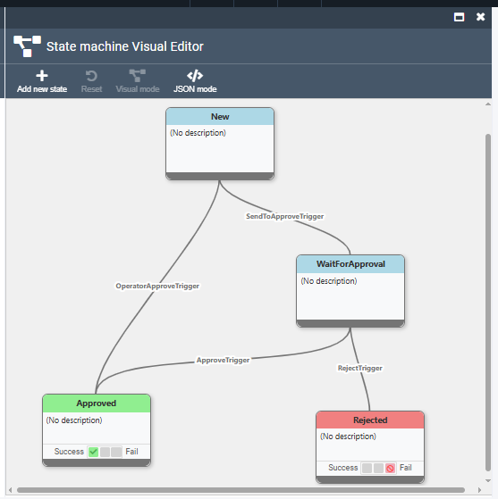

# State Machine Visual Editor

## Overview

The State Machine Visual Editor is an intuitive drag-and-drop interface that allows you to create, edit, and manage state machine workflows without writing code. This powerful tool provides a graphical representation of your business processes, making it easy to design complex workflows and understand their flow at a glance.

## Accessing the Visual Editor

### Navigation Path
1. Log into the Virto Commerce Admin Portal
2. Navigate to **Configuration** → **State Machines**
3. Click **New** to create a new state machine definition or select an existing one to edit
4. On details blade press the button **Open Visual Editor**, or just click to existed state machine preview

### Prerequisites
- Administrative access to the Virto Commerce platform
- Appropriate permissions for state machine management
- A registered entity type (see [Entity Types](03-entity-types.md) documentation)

## Editor Interface Overview

The Visual Editor consists of several key areas:



### Toolbar & Actions
- **Add new state**: Add new state to canvas
- **Reset**: Revert back unsaved data
- **Visual mode**: Turn editing to Visual mode
- **JSON mode**: Hide the canvas and show text panel for direct JSON editing

### Canvas Area
- The place where user draw state machine

## Creating Your First State Machine Definition

### Step 1: Create New State Machine Definition

1. Click **New** in the state machines list
2. Enter a descriptive name (e.g., "Product Approval Workflow")
3. Select the entity type from the dropdown
4. Press **Open Visual Editor** button

### Step 2: Adding States

1. Click **Add new state** from the toolbox - this will show the modal form with state's properties
2. Configure State Properties in the form:

   ```
   Name: New
   Description: My first state
   ```

3. Add additional states following the same process, or start drag new transition from the bottom part of existed state. If user drops transition on empty place - this will create one more state.

### Step 3: Configure Transitions

1. After creating Transition configure Transition properties:

   ```
   Trigger Name: SubmitTrigger
   Description: Submit product for review
   ```

2. Add more States and Transitions - draw the flow

## Advanced Editor Features

### State Configuration

#### Final State Configuration
- **Success States**: Mark positive workflow completion
  ```
  ☑ Is Final State
  ☑ Is Success State
  ☐ Is Failed State
  ```
- **Failure States**: Mark negative workflow completion
  ```
  ☑ Is Final State
  ☐ Is Success State
  ☑ Is Failed State
  ```

### Transition Configuration

#### Conditional Transitions
- **Configure Conditions**: Click "Edit Condition" in transition properties
- **Condition Types**:
  - Role conditions (user permission checks)
  - Custom conditions (business logic)

### Localization Support

#### Adding Localizations
1. **Select State or Transition**, call element's context menu
2. **Open Localization Panel**
3. **Add Language Variants**:
   ```
   English (en-US): "Pending Review"
   French (fr-FR): "En Attente de Révision"
   Spanish (es-ES): "Pendiente de Revisión"
   German (de-DE): "Ausstehende Überprüfung"
   ```

#### Localization Best Practices
- **Consistent Terminology**: Use the same terms across all workflows
- **Cultural Adaptation**: Consider cultural differences in business processes
- **Professional Translation**: Use professional translators for customer-facing text

## Visual Design Best Practices

### Layout Guidelines

#### State Positioning
- **Up to Down Flow**: Arrange states in logical progression
- **Vertical Grouping**: Group related states vertically
- **Consistent Spacing**: Maintain uniform spacing between elements

#### Transition Routing
- **Minimize Crossings**: Avoid overlapping transition lines
- **Clear Paths**: Ensure transition directions are obvious

### Color Coding

#### State Colors
- **Green**: Success states
- **Red**: Failure states
- **Gray**: all other states

## Validation and Testing

### Built-in Validation

The editor automatically validates your state machine for:

#### Structural Issues
- **Missing Initial State**: Every state machine must have exactly one initial state
- **Unreachable States**: All states must be reachable from the initial state
- **Dead Ends**: Non-final states must have at least one outgoing transition

#### Logical Issues
- **Conflicting Conditions**: Multiple transitions with overlapping conditions

## Importing and Exporting

### Export State Machine
In the state machine details blade, use the **Export** toolbar button to download the current state machine definition as a JSON file. This allows you to backup configurations, share workflows between environments, or use as templates.

### Import State Machine
In the state machines list blade, use the **Import** toolbar button to upload and create new state machine definitions from JSON files. This feature enables quick deployment of pre-configured workflows and template-based state machine creation.

## Next Steps

- [Transition Conditions](05-transition-conditions.md): Learn to implement complex business rules
- [Operator Portal Actions](06-operator-portal-actions.md): Integrate with admin interfaces
- [Vendor Portal Actions](07-vendor-portal-actions.md): Implement customer-facing workflows
