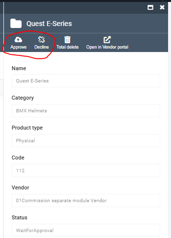

# State Machine Actions in Operator Portal

## Overview

The Operator Portal (VirtoCommerce Platform interface) provides comprehensive state machine management capabilities for administrators and operators. This document explains how to integrate state machine actions into Operator interface and manage entity lifecycles through the administrative portal.

## Implementation Example: Product Publication Request

### Controller Implementation

```javascript
angular.module('virtoCommerce.marketplaceModule')
    .controller('virtoCommerce.marketplaceModule.sellerProductDetailsController',
        ['$scope', ...
        function ($scope, ...) {
          ...
          function initializeBlade(data) {
            ...
              fillTollbarCommands();
            ...
          }

          function fillTollbarCommands() {
              blade.toolbarCommands = [];
              // add toolbuttons that need before state machine actions
              ...
              // then add state machine actions
              if (blade.stateMachineInstance
                  && blade.stateMachineInstance.currentState
                  && blade.stateMachineInstance.currentState.transitions
                  && blade.stateMachineInstance.permittedTriggers
              ) {
                  blade.stateMachineInstance.currentState.transitions.forEach((element, index) => {
                      if (blade.stateMachineInstance.permittedTriggers.includes(element.trigger)) {
                          var command = {
                              id: 'command' + element.trigger,
                              name: element.localizedValue || element.trigger,
                              title: element.description,
                              icon: element.icon,
                              executeMethod: function () {
                                  doAction(element.trigger);
                              }
                          };
                          if (!blade.toolbarCommands.find(x => x.id === "command" + element.trigger)) {
                              blade.toolbarCommands.splice(index, 0, command);
                              addedButtonsCount++;
                          }
                      }
                  });
              }
              // add more toolbuttons after state machine actions, if need
          }

          function doAction(trigger) {
              blade.isLoading = true;
              var stateMachineAction = stateMachineRegistrar.getStateAction(trigger);
              // call registered action if exists, then fire backend trigger
              if (stateMachineAction && stateMachineAction.callbackFn && typeof stateMachineAction.callbackFn === "function") {
                  function successCallback() {
                      doStateMachineStep(trigger);
                  };
                  stateMachineAction.callbackFn(blade, successCallback);
              } else {
                  doStateMachineStep(trigger);
              }

              blade.isLoading = false;
          }

          function doStateMachineStep(trigger) {
              stateMachineApi.fireStateMachineInstanceTrigger({
                  stateMachineInstanceId: blade.stateMachineInstance.id,
                  trigger: trigger,
                  entityId: publicationRequestId
              },
              function (data) {
                  blade.refresh(true);
              });
          }

          ...
          // other blade logic
}]);
```
### Appearance of example



## Next Steps

- [Vendor Portal Actions](07-vendor-portal-actions.md): Learn about customer-facing state machine integration
